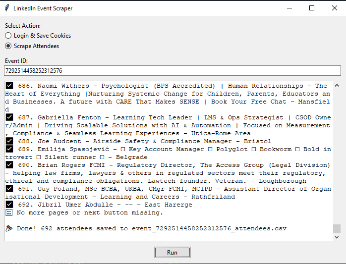

# 🛠️ LinkedIn Event Attendees Scraper

A desktop application built with **Python**, **Selenium**, and **Tkinter** to scrape attendee profiles from a LinkedIn event and save them to a CSV file.

---

## ✅ Features

- 🔐 Manual LinkedIn login with cookie saving
- 👥 Scrapes name, headline, location, and profile URL of event attendees
- 🕒 Human-like scrolling and randomized delay for safe scraping
- 💻 Easy-to-use **GUI** for non-technical users
- 🌐 Optional proxy support for larger scraping sessions
- � Saves results in `.csv` format (compatible with Excel, Google Sheets)
- ⚡ Automated ChromeDriver management with webdriver-manager
- � Advanced HTML parsing with BeautifulSoup integration
- 🛡️ Robust error handling and timeout management

---

## 📸 Screenshot



---

## 🧰 Technologies Used

- **Python 3.7+**
- **Selenium** - Web automation and browser control
- **Tkinter** - Desktop GUI framework
- **WebDriver Manager** - Automatic ChromeDriver management
- **BeautifulSoup4** - HTML parsing and data extraction
- **CSV module** - Data export functionality
- **Optional proxy integration** - For enhanced privacy

---

## � How to Use

### 1. Clone the repo or download the `.zip`

```bash
git clone https://github.com/twaheedgj/Scrape-The-Event.git
cd Scrape-The-Event
```

### 2. Create a virtual environment (recommended)

```bash
python -m venv venv
```

### 3. Activate the virtual environment

- **Windows:**
  ```bash
  venv\Scripts\activate
  ```
- **macOS/Linux:**
  ```bash
  source venv/bin/activate
  ```

### 4. Install Dependencies

```bash
pip install -r requirements.txt
```

### 5. Run the App

```bash
python linkedin_scraper.py
```

> **First-time setup:** Use **Login & Save Cookies** (option 1) to log into your LinkedIn account manually.  
> **Then:** Enter the Event ID and use options 4 or 5 to **Scrape Attendees**.

---

## � Windows Executable

A compiled `.exe` version is available for non-technical users. Just double-click to run (no Python installation needed).

---

## 📁 Output

Attendee data is saved to:
```
event_<event_id>_attendees.csv
```

Example contents:
```csv
Name,Title,Location,Profile_URL
"John Doe","Software Engineer","San Francisco, CA","https://linkedin.com/in/johndoe"
"Jane Smith","Product Manager","New York, NY","https://linkedin.com/in/janesmith"
```

**Additional formats available:**
- **CSV format** - Compatible with Excel and Google Sheets
- **TXT format** - Human-readable text file with detailed formatting

---

## ⚠️ Disclaimer

This tool is for **educational and ethical use only**. Scraping LinkedIn may violate their [Terms of Service](https://www.linkedin.com/legal/user-agreement). Use it responsibly and at your own risk.

### Important Guidelines

- **Personal Use Only**: Intended for personal research and networking purposes
- **Respect Rate Limits**: The tool includes built-in delays to avoid overwhelming LinkedIn's servers
- **Data Privacy**: Handle scraped data responsibly and in compliance with privacy regulations
- **Public Data Only**: Can only access publicly visible attendee information
- **Legal Compliance**: Users are responsible for complying with applicable laws and LinkedIn's Terms of Service

---

## 👤 Author

**Talha Waheed**  
📧 talhawaheed7807@gmail.com

---

## 🛠️ Troubleshooting

### Common Issues

**Chrome/ChromeDriver Issues:**
- The tool automatically manages ChromeDriver using webdriver-manager
- Ensure Google Chrome is installed and up to date

**Login Problems:**
- Clear browser cookies and re-run option 1
- Ensure your LinkedIn account has access to the event
- Check for two-factor authentication requirements

**No Attendees Found:**
- Event may be private or have no public attendees
- Verify the event ID or URL is correct
- Check your LinkedIn account permissions

---

## 🤝 Contributing

Contributions are welcome! Please:
1. Fork the repository
2. Create a feature branch
3. Test your changes thoroughly
4. Submit a pull request with a clear description

---

**Disclaimer**: This tool is provided as-is for educational purposes. Users are solely responsible for ensuring ethical and legal use in compliance with LinkedIn's Terms of Service and applicable laws.
